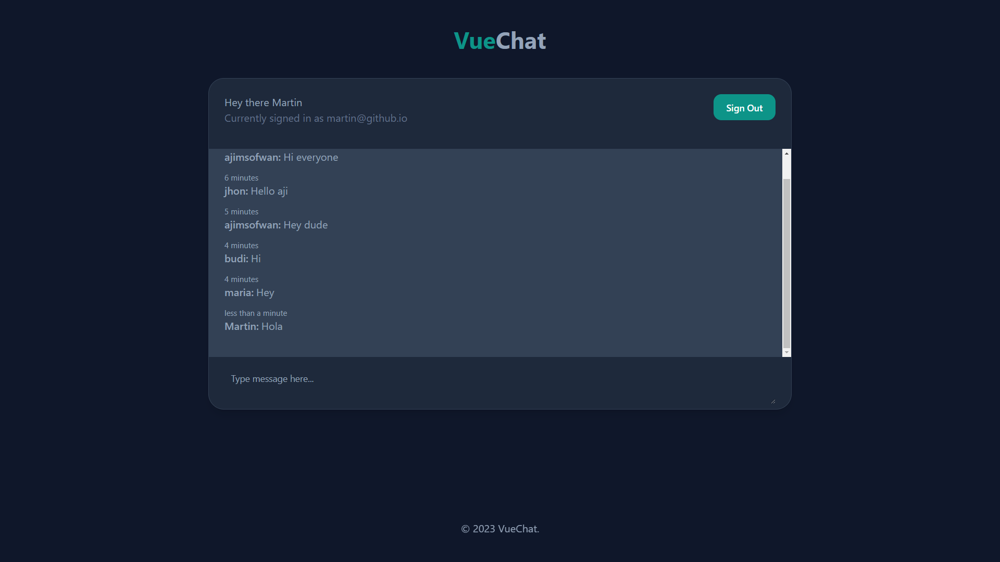

# Simple Live Chat App with Vite + Vue + Firebase

A minimalistic live chat application built with Vite, Vue, and Firebase for real-time communication.

## Demo

You can play the game online at [Demo Link](https://ajimsofwan.github.io/vue-chat/).

## Features

- Real-time chat with multiple users
- Simple and intuitive user interface
- Vite for fast and efficient development
- Vue for building interactive user interfaces
- Firebase for real-time database and authentication